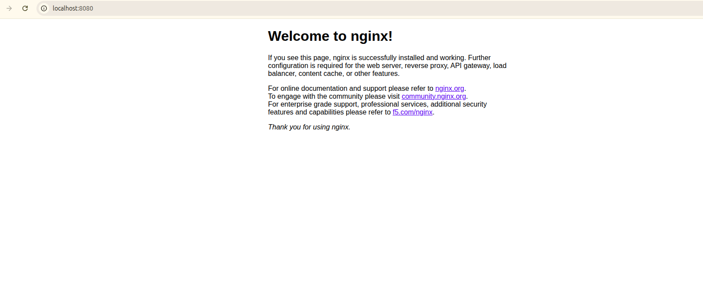
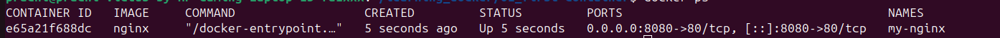

# 01 — First Container

## What I Learned
- Docker is a platform that lets you package and run apps in isolated environments called containers — no more "it works on my machine" problems
- An image is like a blueprint, a container is the running instance of that blueprint
- Port mapping is needed because the container lives in its own network — without it, your browser can't reach it
- Docker pulls images in layers, so if a layer already exists locally it skips it — super efficient

## Commands Used

### Verify Docker Installation
```bash
docker --version
docker info
```
Confirmed Docker is installed and the daemon is running on my machine

### Pull nginx Image
```bash
docker pull nginx
```
Docker contacted Docker Hub and downloaded the nginx image layer by layer — only missing layers are downloaded

### Run the Container
```bash
docker run -d -p 8080:80 --name my-nginx nginx
```
- `-d` runs it in background so terminal stays free
- `-p 8080:80` maps my machine's port 8080 to container's port 80
- `--name` gives it a friendly name instead of a random one

### Verify Running Container
```bash
docker ps
```

### Stop & Remove
```bash
docker stop my-nginx
docker rm my-nginx
```
- `stop` gracefully shuts the container down
- `rm` deletes it from disk — stop doesn't delete, just halts it

## Output Screenshots

### nginx Welcome Page


### docker ps Output


## Verification
- `http://localhost:8080` showed nginx welcome page 
- `docker ps` confirmed container running with correct port mapping 
- `docker stop` & `docker rm` completed without errors 

## Key Concepts
| Term | My Understanding |
|------|-----------------|
| Image | A read-only template/blueprint to create containers from |
| Container | A live running instance of an image |
| Port Mapping | A bridge between my host machine and the container's network |
| Docker Hub | A public registry where Docker images are stored and shared |

##  Errors I Hit
- Got "container name already in use" conflict — fixed it with `docker rm -f my-nginx` and reran
