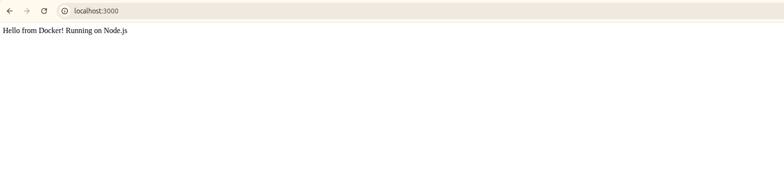
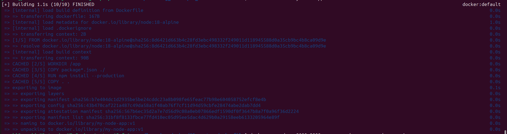

# 02 — Custom Dockerfile

## 🎯 What I Learned
- A Dockerfile is a script of instructions that Docker executes to build an image
- Each instruction in a Dockerfile creates a new read-only layer
- Copying package.json before source code is a layer caching optimization — rebuilds are faster
- Alpine base images are tiny (~50MB) compared to full Node.js images

## 🛠️ Files Created
- `app.js` — simple Express server responding on port 3000
- `package.json` — declares express as a dependency
- `Dockerfile` — instructions to build the image

## 🛠️ Commands Used

### Build the Image
```bash
docker build -t my-node-app:v1 .
```
Docker executes each Dockerfile instruction top to bottom — each line is a new layer

### Run the Container
```bash
docker run -d -p 3000:3000 --name node-app my-node-app:v1
```

### Check Logs
```bash
docker logs node-app
```
Shows "Server running on port 3000"

### Verify Running
```bash
docker ps
```

## 📸 Output Screenshots

### Browser Output


### Docker Build Output


## ✅ Verification
- `docker images` shows `my-node-app` with tag `v1` ✅
- `docker logs node-app` shows `Server running on port 3000` ✅
- `http://localhost:3000` returns `Hello from Docker!` ✅

## 💡 Key Concepts
| Instruction | My Understanding |
|-------------|-----------------|
| FROM | Sets the base image to build from |
| WORKDIR | Sets working directory inside container |
| COPY | Copies files from host to container |
| RUN | Executes command during build |
| EXPOSE | Documents which port container listens on |
| CMD | Default command when container starts |


