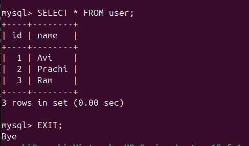

<<<<<<< HEAD
# 03 — Persistent Volumes

## 🎯 What I Learned
- By default container data is lost when container is removed — volumes fix this
- A Docker volume lives outside the container on the host machine
- Same volume can be mounted to multiple containers — data survives container deletion
- This is critical for databases in production

## 🛠️ Commands Used

### Create Volume
```bash
docker volume create db_data
```
Creates a named volume managed by Docker

### Run MySQL with Volume
```bash
docker run -d \
  --name mysql-db \
  -e MYSQL_ROOT_PASSWORD=MySecret123 \
  -e MYSQL_DATABASE=testdb \
  -v db_data:/var/lib/mysql \
  -p 3306:3306 \
  mysql:8
```

### Verify Volume
```bash
docker volume ls
docker volume inspect db_data
```

## 📸 Output Screenshots

### Data Inserted


### Data Persisted After Container Deletion


> **Note:** Both screenshots show the same output intentionally — this proves that even after the original container was deleted, the new container retrieved the exact same data from the volume. Same output = successful persistence! ✅


## ✅ Verification
- `docker volume ls` shows `db_data` ✅
- Avi,Prachi,Ram visible after container deletion ✅
- New container `mysql-db-new` reads same data ✅

## 💡 Key Concepts
| Term | My Understanding |
|------|-----------------|
| Named Volume | Storage managed by Docker, lives outside container |
| -v flag | Mounts a volume into the container at specified path |
| Data Persistence | Data survives even after container is deleted |
| Stateful Container | Container that needs to remember data (like a database) |


=======
# 🐳 Docker Lab

> Hands-on Docker practice from beginner to advanced — covering containers, volumes, networking, Compose, registries, multi-stage builds, and CI/CD.


---

## 📁 Structure

| # | Folder | Topic | Level |
|---|--------|-------|-------|
| 1 | `01-first-container` | Install Docker & run your first container | ⭐ Beginner |
| 2 | `02-custom-dockerfile` | Write a Dockerfile & build a custom image | ⭐ Beginner |
| 3 | `03-persistent-volumes` | Persist data with Docker volumes | ⭐⭐ Beginner-Intermediate |
| 4 | `04-container-networking` | Container networking & DNS resolution | ⭐⭐ Intermediate |
| 5 | `05-docker-compose` | Multi-container app with Docker Compose | ⭐⭐ Intermediate |
| 6 | `06-dockerhub-registry` | Push & pull images on Docker Hub | ⭐⭐ Intermediate |
| 7 | `07-multistage-builds` | Optimize images with multi-stage builds | ⭐⭐⭐ Advanced |
| 8 | `08-cicd-github-actions` | Automate builds with GitHub Actions | ⭐⭐⭐ Advanced |

---

## ✅ Progress

- [ ] 01 — First Container
- [ ] 02 — Custom Dockerfile
- [ ] 03 — Persistent Volumes
- [ ] 04 — Container Networking
- [ ] 05 — Docker Compose
- [ ] 06 — DockerHub Registry
- [ ] 07 — Multi-stage Builds
- [ ] 08 — CI/CD GitHub Actions

---
## 🛠️ Prerequisites

- Windows 10/11 with Docker Desktop installed **or** Ubuntu 20.04+
- Git & GitHub account
- Docker Hub account
- Basic terminal knowledge
>>>>>>> bc08f8d448e63092394e27f586d688bd796dcdcd
