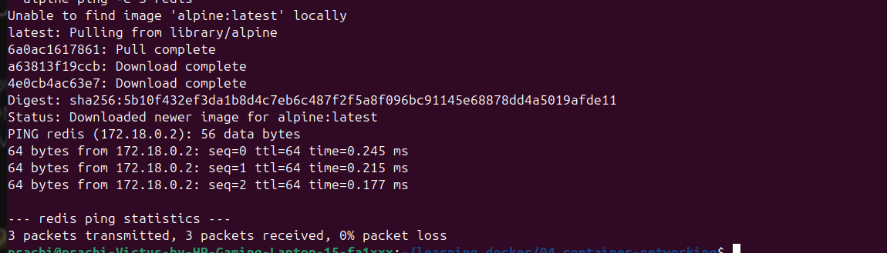

# 04 — Container Networking

## 🎯 What I Learned
- Docker has built-in DNS — containers can talk to each other using container names
- User-defined bridge networks provide automatic DNS resolution
- Default bridge network does NOT have DNS — always create custom networks
- No hardcoded IPs needed — just use container name as hostname

## 🛠️ Commands Used

### Create Network
```bash
docker network create app-net
```

### Run Redis on Network
```bash
docker run -d --name redis --network app-net redis:7-alpine
```

### Ping Test
```bash
docker run --rm --network app-net alpine ping -c 3 redis
```

### Redis CLI Test
```bash
docker run --rm -it --network app-net redis:7-alpine redis-cli -h redis
```

### Inspect Network
```bash
docker network inspect app-net
```

## 📸 Output Screenshots
### Ping Success


### Redis CLI


## ✅ Verification
- `ping redis` succeeded from another container ✅
- `GET greeting` returned correct value ✅
- `docker network inspect` showed redis in Containers section ✅

## 💡 Key Concepts
| Term | My Understanding |
|------|-----------------|
| Bridge Network | Default network driver for single-host communication |
| DNS Resolution | Docker resolves container names to IPs automatically |
| --network flag | Connects container to a specific network |
| --rm flag | Auto-removes container when it exits |


