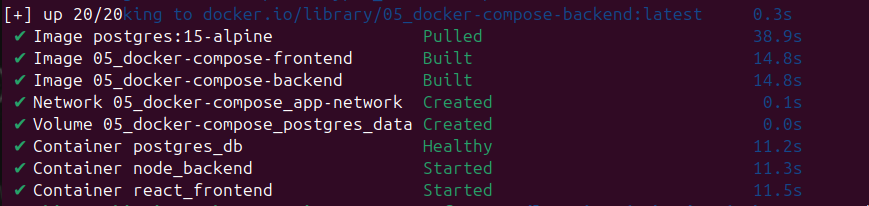
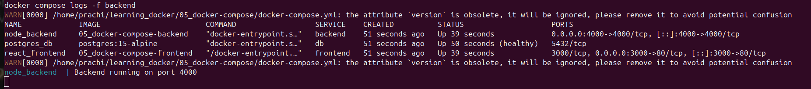

# 05 — Docker Compose

## 🎯 What I Learned
- Docker Compose manages multi-container apps with a single file
- Services communicate using service names as hostnames — Docker DNS handles it
- depends_on with healthcheck ensures correct startup order
- One command to start everything — one command to stop everything

## 🛠️ Files Created
- `docker-compose.yml` — defines all 3 services
- `backend/` — Node.js Express API connected to PostgreSQL
- `frontend/` — nginx serving static HTML

## 🛠️ Commands Used

### Start All Services
```bash
docker compose up -d
```

### Check Status
```bash
docker compose ps
```

### View Logs
```bash
docker compose logs -f backend
```

### Stop Everything
```bash
docker compose down
```

## 📸 Output Screenshots

### Docker Compose Up


### Docker Compose PS


### Frontend - localhost:3000


### Backend - localhost:4000


## ✅ Verification
- All 3 services running ✅
- Frontend loads at localhost:3000 ✅
- Backend responds at localhost:4000 ✅

## 💡 Key Concepts
| Term | My Understanding |
|------|-----------------|
| docker-compose.yml | Single file defining entire app stack |
| depends_on | Controls service startup order |
| healthcheck | Checks if service is actually ready |
| networks | All services share same network — talk by name |


