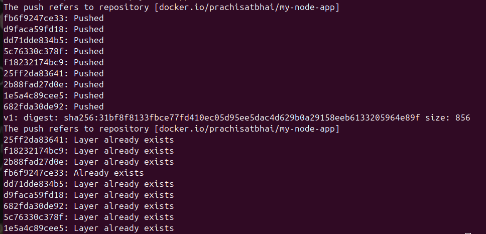
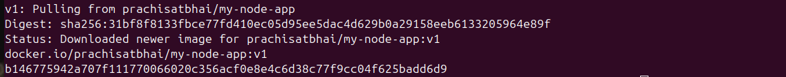

# 06 — DockerHub Registry

##  What I Learned
- Docker Hub is a public registry to store and share images
- Tagging adds an alias to existing image — image ID stays same
- Docker uploads only new layers — existing layers are skipped
- In production, private registries like ECR, GCR, ACR are used

## Commands Used

### Login
```bash
docker login
```

### Tag Image
```bash
docker tag my-node-app:v1 prachisatbhai0741/my-node-app:v1
```

### Push
```bash
docker push prachisatbhai0741/my-node-app:v1
```

### Pull
```bash
docker pull prachisatbhai0741/my-node-app:v1
```

## Output Screenshots
### Push Output


### DockerHub Repo


## Verification
- Image visible on hub.docker.com 
- Pull succeeded after local delete 
- Container ran from pulled image 

##  Key Concepts
| Term | My Understanding |
|------|-----------------|
| Registry | Central store for Docker images |
| Tag | Alias/label for an image version |
| Push | Upload image layers to registry |
| Pull | Download image from registry |


