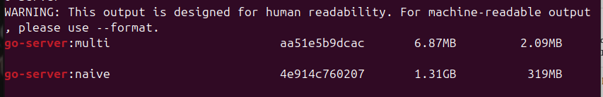
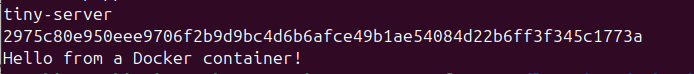

# 07 — Multistage Builds

## What I Learned
- Multi-stage builds use multiple FROM instructions — only final stage goes to production
- Build tools and SDKs are NOT needed at runtime — multi-stage removes them
- FROM scratch means zero OS — just the binary — ultimate size optimization
- 850MB dev image → 10MB production image — same app!

## Files Created
- `main.go` — simple Go HTTP server
- `naive.Dockerfile` — single stage, includes entire Go SDK (~850MB)
- `Dockerfile` — multi-stage, final image from scratch (~10MB)

## Commands Used

### Build Naive (Single Stage)
```bash
docker build -f naive.Dockerfile -t go-server:naive .
```

### Build Multistage
```bash
docker build -t go-server:multi .
```

### Compare Sizes
```bash
docker images | grep go-server
```


### Run and Test
```bash
docker run -d -p 8080:8080 go-server:multi
curl http://localhost:8080
```


## Verification
- multi image < 15MB
- naive image > 800MB
- `curl http://localhost:8080` returns response

## Key Concepts
| Term | My Understanding |
|------|-----------------|
| Multi-stage Build | Multiple FROM instructions — cherry pick what goes to final image |
| FROM scratch | Empty image — no OS, no shell, just the binary |
| COPY --from | Copy files from a previous build stage |
| CGO_ENABLED=0 | Fully self-contained binary — no C dependencies |

## Errors I Hit
- Need to run `go mod init` before building
